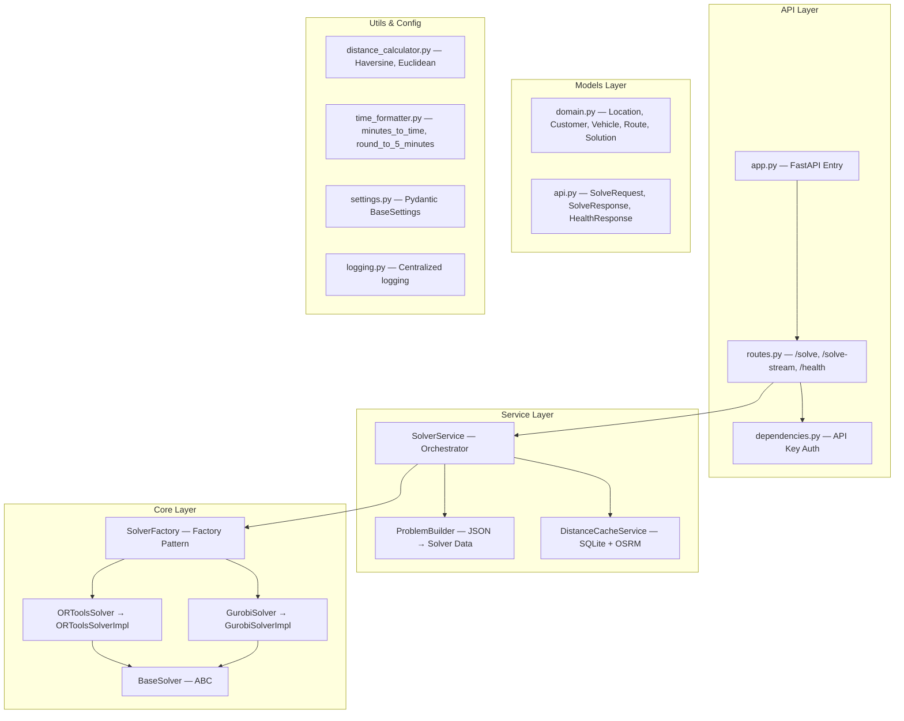

# Layer 4 — Routing Engine: Brainstorming & Architecture Plan

## 1. Mục tiêu

Biến **fleet-route-optimizer-cvrptw** (một hệ thống logistics giao hàng) thành **Lõi Toán học Định tuyến** cho ứng dụng du lịch thông minh. Lõi này sẽ nhận danh sách ≤ 50 POIs (Points of Interest) đã được lọc từ Layer 3 (PostGIS + pgvector) và trả về lịch trình tối ưu cho du khách.

---

## 2. Kiến trúc hiện tại — Đánh giá chi tiết

### 2.1 Sơ đồ module

### 2.2 Điểm mạnh (giữ lại)

| Thành phần | Đánh giá | Ghi chú |
|---|---|---|
| **Clean Architecture** (6 layers) | ✅ Tốt | API → Service → Core → Models → Utils → Config |
| **Factory Pattern** cho Solver | ✅ Tốt | Dễ mở rộng thêm solver mới |
| **Pydantic Models** (type-safe) | ✅ Tốt | 15+ models với Field descriptions |
| **Distance Cache** (SQLite + OSRM) | ✅ Rất tốt | Tránh gọi OSRM lặp, cache 3 khung giờ giao thông |
| **SSE Streaming** | ✅ Tốt | Real-time log streaming cho frontend |
| **OR-Tools CVRPTW** implementation | ✅ Lõi chính | Capacity + Time Windows constraints |
| **Traffic Pattern** (sáng/chiều/tối) | ✅ Phù hợp | morning +15%, evening +10% |
| **Docker Compose** ready | ✅ Tốt | Backend + Frontend + OSRM |

### 2.3 Vấn đề cần thay đổi cho Travel Optimization

> [!IMPORTANT]
> Hệ thống hiện tại được thiết kế cho **logistics giao hàng** (fleet of delivery trucks). Để phục vụ **du lịch cá nhân**, cần thay đổi đáng kể về domain model và logic.

| Vấn đề | Mô tả | Mức độ |
|---|---|---|
| **Domain mismatch** | `Customer` + `demand_units` + `Vehicle capacity` → cần chuyển thành `POI` + `visit_duration` + `Traveler preferences` | 🔴 Cao |
| **Single-depot CVRPTW** | Du lịch cần khách sạn (hotel) làm depot, có thể thay đổi mỗi ngày (multi-day trip) | 🔴 Cao |
| **Không có multi-day planning** | Hiện tại chỉ giải 1 ngày. Du lịch cần lập lịch cho N ngày liên tục | 🔴 Cao |
| **Service time cố định** | `10 min + 2 min/unit` (logic giao hàng) → cần `visit_duration` riêng cho từng POI (30 min → 3h) | 🟡 Trung bình |
| **Capacity constraint bất hợp lý** | Du khách không có "sức chứa". Cần thay bằng ràng buộc **budget** hoặc **max POIs/ngày** | 🟡 Trung bình |
| **OSRM public server** | Dùng `router.project-osrm.org` (rate-limited, không ổn định). Cần self-host OSRM Docker cho Việt Nam | 🟡 Trung bình |
| **Synchronous solver** | `SolverService.solve()` chạy đồng bộ với `threading.Lock`. Layer 3 (FastAPI async) cần interface async | 🟡 Trung bình |
| **Không có re-routing** | Thiếu endpoint `/re-route` để tính lại khi du khách thay đổi lịch trình | 🟡 Trung bình |
| **SQLite cho cache** | OK cho prototype, nhưng kiến trúc tổng thể dùng PostgreSQL. Nên hợp nhất | 🟢 Thấp |
| **Gurobi dependency** | License thương mại, không cần thiết cho travel. Chỉ giữ OR-Tools | 🟢 Thấp |

---

## 3. Đề xuất Kiến trúc mới

### 3.1 Approach A: Refactor In-Place (✅ Đề xuất)

Giữ nguyên kiến trúc Clean Architecture hiện tại, thay đổi domain models và business logic từ "logistics" → "travel".

**Ưu điểm:**
- Tận dụng tối đa code chất lượng đã có (Factory, Cache, SSE, OR-Tools wrapper)
- Không phải viết lại từ đầu
- Giữ được testing patterns

**Nhược điểm:**
- Cần cẩn thận không phá vỡ cấu trúc hiện tại

### 3.2 Approach B: Extract Core Only

Chỉ lấy `ortools_impl.py` và `distance_cache.py`, viết lại mọi thứ khác.

**Ưu điểm:** Clean start
**Nhược điểm:** Mất nhiều code tốt (routes.py, SSE streaming, settings, factory pattern)

### 3.3 Approach C: Wrapper Layer

Giữ nguyên fleet-route-optimizer, viết một adapter layer bọc ngoài chuyển đổi travel → logistics → travel.

**Ưu điểm:** Không sửa code gốc
**Nhược điểm:** Phức tạp, khó debug, performance overhead

> [!TIP]
> **Đề xuất: Approach A** — Refactor In-Place. Đây là cách hiệu quả nhất, tận dụng 70-80% code hiện tại trong khi chỉ thay đổi domain model và business logic.

---

## 4. Phân chia công việc theo Phase

### Phase 1: Domain Model Transformation (Travel-ify)
> Chuyển đổi toàn bộ domain từ logistics sang travel

- Đổi `Customer` → `POI` (Point of Interest) với các trường: `name`, `category`, `location`, `visit_duration_min`, `time_window`, `priority_score`
- Đổi `Vehicle` → `DayPlan` với: `day_index`, `max_walking_time_min`, `max_pois`, `start_time`, `end_time`
- Đổi `Depot` → `Hotel` (hoặc `StartPoint`): vị trí khách sạn/điểm xuất phát
- Đổi `demand_units` → `visit_duration_min` (thời gian tham quan)
- Đổi `capacity_units` → `max_daily_minutes` (tổng thời gian hoạt động/ngày)
- Cập nhật `SolveRequest` → `TravelPlanRequest`
- Cập nhật `Solution` → `TravelItinerary`

### Phase 2: Solver Logic Adaptation
> Điều chỉnh OR-Tools solver cho bài toán du lịch

- **Capacity constraint** → Áp dụng lại: capacity = `max_daily_minutes`, demand = `visit_duration_min`
- **Time Windows** → Giữ nguyên (giờ mở cửa/đóng cửa POI)
- **Service time** → Lấy từ `visit_duration_min` của từng POI (không còn formula cố định)
- **Multi-day**: Mỗi ngày = 1 "vehicle" (giải N ngày = N vehicles, mỗi vehicle có depot = hotel ngày đó)
- **Vehicle penalty** → Day penalty (khuyến khích dùng ít ngày hơn)
- **Objective**: Minimize tổng thời gian di chuyển (maximize thời gian tham quan)

### Phase 3: OSRM Self-Hosting (Vietnam)
> Triển khai OSRM Docker cho dữ liệu đường Việt Nam

- Tải OSM data cho Vietnam từ Geofabrik
- Cấu hình OSRM Docker container (`osrm-backend`)
- Cập nhật `docker-compose.yml` thêm service `osrm`
- Cập nhật `settings.py`: `OSRM_BASE_URL` → `http://osrm:5000`
- Giữ fallback sang public OSRM nếu local unavailable

### Phase 4: Async Interface cho Layer 3
> Cung cấp interface async để Layer 3 (FastAPI Gateway) gọi

- Chuyển `SolverService.solve()` sang async (dùng `asyncio.to_thread`)
- Thêm endpoint `POST /re-route` (tính lại khi du khách thay đổi lịch trình giữa chừng)
- Cập nhật SSE streaming để hỗ trợ giao thức của Layer 3
- Thêm endpoint `POST /plan` với input format phù hợp Layer 3 (nhận 50 POIs + user constraints)

### Phase 5: Testing & Integration
> Đảm bảo chất lượng trước khi tích hợp

- Unit tests cho mỗi model mới
- Integration test: gửi 50 POIs TP.HCM → nhận itinerary 3 ngày
- Performance test: solver phải trả kết quả < 60s cho 50 POIs
- Contract test: verify input/output format với Layer 3

---

## 5. User Review Required

> [!IMPORTANT]
> **Quyết định quan trọng cần anh/chị xác nhận:**
> 1. **Approach A (Refactor In-Place)** — anh/chị có đồng ý hướng này không?
> 2. **Multi-day planning** — mỗi ngày du lịch sẽ map thành 1 "vehicle" trong CVRPTW. Đây có phải cách anh/chị muốn xử lý không?
> 3. **Gurobi** — em đề xuất loại bỏ solver Gurobi (giữ lại OR-Tools). Có OK không?
> 4. **SQLite cache** — giữ SQLite cho distance cache ở Layer 4, hay muốn chuyển sang PostgreSQL để đồng nhất với Layer 3?
> 5. **Phạm vi Phase 1** — anh/chị muốn em bắt tay làm Phase nào trước?

## Open Questions

> [!WARNING]
> Các câu hỏi ảnh hưởng trực tiếp đến thiết kế:
> 1. **Budget constraint**: Du khách có ràng buộc ngân sách (giá vé tham quan) không? Nếu có, cần thêm `entrance_fee` vào POI model.
> 2. **Meal breaks**: Có cần tự động chèn giờ ăn trưa/tối vào lịch trình không?
> 3. **Walking vs Driving**: Du khách di chuyển bằng phương tiện gì? Chỉ xe hơi hay kết hợp đi bộ + taxi + xe buýt?
> 4. **Hotel changes**: Trong chuyến multi-day, du khách có thay đổi khách sạn giữa các ngày không? (multi-depot)

---

## 6. Verification Plan

### Automated Tests
- `pytest tests/` — unit tests cho domain models, solver logic
- `python -m src.app` — verify server starts without errors
- Integration test script: POST 50 POIs → verify itinerary structure

### Manual Verification
- Chạy solver với dữ liệu TP.HCM thật → kiểm tra routes trên bản đồ
- So sánh thời gian di chuyển OSRM vs Google Maps
- Kiểm tra time windows (giờ mở cửa POI) có được tôn trọng
