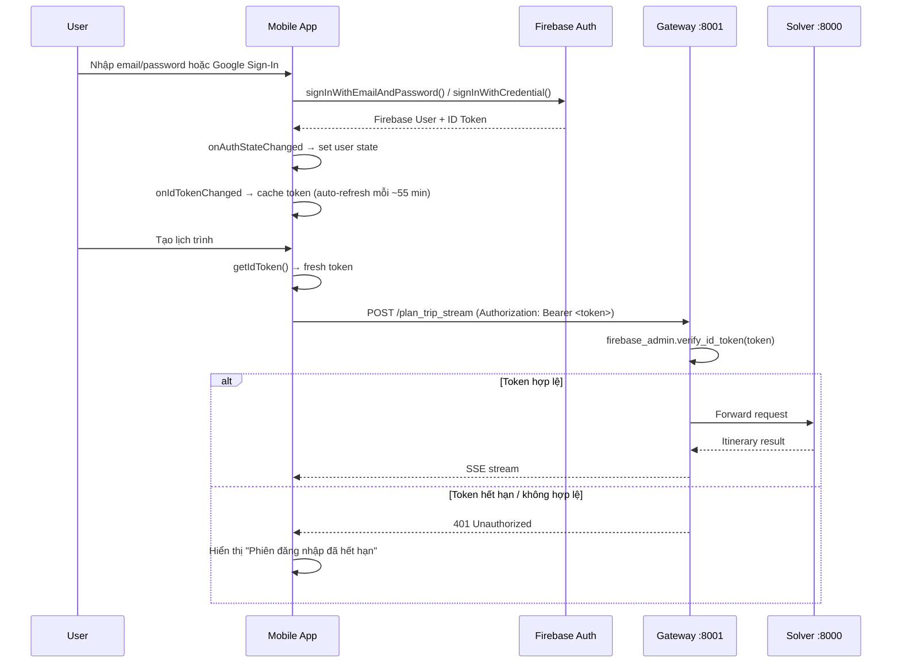

# 🔐 Walkthrough — Sprint 1: Firebase Auth Integration

## Tổng quan

Đã thay thế hoàn toàn hệ thống **mock auth** (MMKV + setTimeout) bằng **Firebase Auth thật** cho cả Mobile App và Gateway backend.

### Luồng xác thực mới



---

## Files đã tạo mới (4 files)

### 1. [authErrors.ts](file:///d:/tư duy tính toán/vibe code/group_work/AIAI-main/AIAI-main/mobile layer/AITravelOptimizer/app/utils/authErrors.ts)
- Map 15+ Firebase error codes → thông báo tiếng Việt thân thiện
- Helper: `getFirebaseErrorMessage()`, `isNetworkError()`, `shouldSuggestAlternateAuth()`
- Ví dụ: `auth/wrong-password` → "Mật khẩu không chính xác."

### 2. [firebaseAuth.ts](file:///d:/tư duy tính toán/vibe code/group_work/AIAI-main/AIAI-main/mobile layer/AITravelOptimizer/app/services/firebase/firebaseAuth.ts)
- Core service wrapping `@react-native-firebase/auth`
- Functions: `signInWithEmail()`, `signUpWithEmail()`, `signInWithGoogle()`, `signOut()`, `sendPasswordReset()`, `getIdToken()`
- Google Sign-In configuration via `configureGoogleSignIn()`

### 3. [firebase_verify.py](file:///d:/tư duy tính toán/vibe code/group_work/AIAI-main/AIAI-main/layer2_3_gateway/app/middleware/firebase_verify.py)
- FastAPI dependency `get_current_user()` — verifies Firebase ID token, returns `FirebaseUser(uid, email, name, picture)`
- `get_optional_user()` — returns `None` instead of 401 for optional auth
- Firebase Admin SDK initialized from env var / settings (never hardcoded)
- Handles: `RevokedIdTokenError`, `ExpiredIdTokenError`, `InvalidIdTokenError`

### 4. [middleware/__init__.py](file:///d:/tư duy tính toán/vibe code/group_work/AIAI-main/AIAI-main/layer2_3_gateway/app/middleware/__init__.py)
- Package init cho middleware module

---

## Files đã sửa đổi (10 files)

### Mobile Layer

| File | Thay đổi |
|------|---------|
| [AuthContext.tsx](file:///d:/tư duy tính toán/vibe code/group_work/AIAI-main/AIAI-main/mobile layer/AITravelOptimizer/app/context/AuthContext.tsx) | **Rewrite hoàn toàn.** MMKV → Firebase `onAuthStateChanged` + `onIdTokenChanged`. Expose `user`, `isLoading`, `getToken()`, `login()`, `register()`, `loginWithGoogle()`, `logout()`, `resetPassword()` |
| [LoginScreen.tsx](file:///d:/tư duy tính toán/vibe code/group_work/AIAI-main/AIAI-main/mobile layer/AITravelOptimizer/app/screens/LoginScreen.tsx) | `setTimeout` mock → `login()` from AuthContext. Google Sign-In button wired. Forgot Password functional. Vietnamese UI text. |
| [RegisterScreen.tsx](file:///d:/tư duy tính toán/vibe code/group_work/AIAI-main/AIAI-main/mobile layer/AITravelOptimizer/app/screens/RegisterScreen.tsx) | `setTimeout` mock → `register()` with displayName. Google Sign-In wired. Password length validation. Vietnamese UI. |
| [tripService.ts](file:///d:/tư duy tính toán/vibe code/group_work/AIAI-main/AIAI-main/mobile layer/AITravelOptimizer/app/services/api/tripService.ts) | **Rewrite.** Every request includes `Authorization: Bearer <token>`. Token fetched fresh via `auth().currentUser.getIdToken()`. SSE uses async init pattern. 401 handling with Vietnamese message. |
| [useTripPipeline.ts](file:///d:/tư duy tính toán/vibe code/group_work/AIAI-main/AIAI-main/mobile layer/AITravelOptimizer/app/hooks/useTripPipeline.ts) | Added 401 error detection with Vietnamese "Phiên đăng nhập hết hạn" message. |
| [AppNavigator.tsx](file:///d:/tư duy tính toán/vibe code/group_work/AIAI-main/AIAI-main/mobile layer/AITravelOptimizer/app/navigators/AppNavigator.tsx) | Added `isLoading` check — returns `null` while Firebase initializes to prevent login screen flash. |
| [features.ts](file:///d:/tư duy tính toán/vibe code/group_work/AIAI-main/AIAI-main/mobile layer/AITravelOptimizer/app/config/features.ts) | Added `ENABLE_FIREBASE_AUTH` and `ENABLE_GOOGLE_SIGN_IN` flags. |

### Gateway Layer

| File | Thay đổi |
|------|---------|
| [config.py](file:///d:/tư duy tính toán/vibe code/group_work/AIAI-main/AIAI-main/layer2_3_gateway/app/config.py) | Added `FIREBASE_PROJECT_ID` and `FIREBASE_SERVICE_ACCOUNT_PATH` settings. |
| [trip_planner.py](file:///d:/tư duy tính toán/vibe code/group_work/AIAI-main/AIAI-main/layer2_3_gateway/app/api/trip_planner.py) | All data endpoints (`plan_trip`, `plan_trip_stream`, `chat_process`, `search_pois`, `re_route`) now require `Depends(get_current_user)`. Health check stays public. User uid logged per request. |
| [.gitignore](file:///d:/tư duy tính toán/vibe code/group_work/AIAI-main/AIAI-main/layer2_3_gateway/.gitignore) | Added Firebase service account JSON patterns (`firebase-service-account*.json`, `*-firebase-adminsdk-*.json`). |

---

## ⚙️ Setup Manual Cần Thực Hiện

### 1. Firebase Console
1. Tạo project mới tại [console.firebase.google.com](https://console.firebase.google.com)
2. **Authentication → Sign-in method**: Bật Email/Password + Google
3. **Project Settings → General**: Download `google-services.json` cho Android
4. **Project Settings → General**: Download `GoogleService-Info.plist` cho iOS
5. **Project Settings → Service accounts**: Generate private key JSON

### 2. Android SHA-1
```bash
cd "mobile layer/AITravelOptimizer/android"
./gradlew signingReport
```
Copy SHA-1 → Firebase Console → Project Settings → Android app → Add fingerprint

### 3. Install Dependencies
```bash
# Mobile
cd "mobile layer/AITravelOptimizer"
npm install @react-native-firebase/app @react-native-firebase/auth @react-native-google-signin/google-signin
npx expo prebuild --clean

# Gateway
cd layer2_3_gateway
pip install firebase-admin
```

### 4. Environment Variables

**Mobile** (`.env` hoặc `app.config.ts`):
```
EXPO_PUBLIC_GOOGLE_WEB_CLIENT_ID=xxxxxxxxxxxx.apps.googleusercontent.com
EXPO_PUBLIC_API_URL=http://your-gateway:8001
```

**Gateway** (`.env`):
```
FIREBASE_PROJECT_ID=your-project-id
FIREBASE_SERVICE_ACCOUNT_PATH=./firebase-service-account.json
```

### 5. File Placement
```
mobile layer/AITravelOptimizer/
├── android/app/google-services.json     ← Download from Firebase
├── ios/GoogleService-Info.plist          ← Download from Firebase

layer2_3_gateway/
├── firebase-service-account.json        ← Download from Firebase (GITIGNORED)
```

---

## Token Refresh Strategy

> [!NOTE]
> Firebase ID tokens expire after **1 hour**. Đã implement dual strategy:
> 1. **`onIdTokenChanged` listener** trong AuthContext — Firebase tự động refresh token ~5 phút trước khi hết hạn và notify listener
> 2. **Fresh token per API call** — `tripService.ts` gọi `getIdToken()` trước mỗi request, Firebase SDK tự quyết định có cần refresh hay không
>
> Kết quả: User **không bao giờ** bị đá ra do token hết hạn trong phiên sử dụng bình thường.
