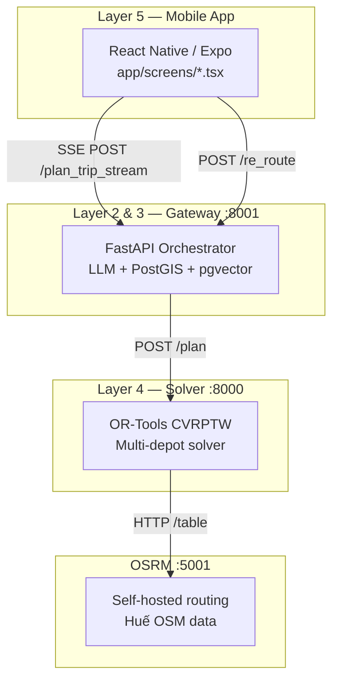

# 📊 Báo Cáo Tình Hình & Kế Hoạch Triển Khai — AIAI Travel Optimizer

## Mục tiêu
Đảm bảo app có **login thực (Firebase Auth)**, **xử lý lỗi tốt** cho mọi trường hợp, và **test trải nghiệm như user thật** với 100 prompt đầu vào.

---

## 🏗️ Kiến trúc hiện tại (Tóm tắt)



---

## 📋 Đánh Giá 7 Hạng Mục Ưu Tiên

### 1. 🔐 Firebase Auth

| Hạng mục | Hiện trạng | Đánh giá |
|----------|-----------|----------|
| AuthContext | Có [AuthContext.tsx](file:///d:/tư duy tính toán/vibe code/group_work/AIAI-main/AIAI-main/mobile layer/AITravelOptimizer/app/context/AuthContext.tsx) — dùng MMKV lưu token local | ⚠️ Mock |
| Login | [LoginScreen.tsx](file:///d:/tư duy tính toán/vibe code/group_work/AIAI-main/AIAI-main/mobile layer/AITravelOptimizer/app/screens/LoginScreen.tsx) — `handleLogin()` dùng `setTimeout(800ms)` rồi set token = `Date.now()` | ❌ **Fake auth** |
| Register | [RegisterScreen.tsx](file:///d:/tư duy tính toán/vibe code/group_work/AIAI-main/AIAI-main/mobile layer/AITravelOptimizer/app/screens/RegisterScreen.tsx) — Cũng mock tương tự | ❌ **Fake auth** |
| Social Login | Google/Facebook buttons — `onPress={() => {}}` (no-op) | ❌ **Không hoạt động** |
| Token refresh | Không có logic refresh token | ❌ **Chưa có** |
| Backend auth | Gateway & Solver không kiểm tra Firebase token từ mobile | ❌ **Không verify** |

> [!CAUTION]
> **Kết luận:** Toàn bộ hệ thống auth hiện tại là **MOCK**. Bất kỳ ai cũng có thể nhấn Sign In với bất kỳ email/password và vào app. Không có Firebase nào được tích hợp.

**Công việc cần làm:**
- Cài `@react-native-firebase/app` + `@react-native-firebase/auth`
- Tạo Firebase project, download `google-services.json` / `GoogleService-Info.plist`
- Refactor `AuthContext.tsx` → dùng `firebase.auth()` thay MMKV mock
- Refactor `LoginScreen.tsx` → gọi `signInWithEmailAndPassword()`
- Implement Google Sign-In (`@react-native-google-signin/google-signin`)
- Thêm Firebase token vào header API calls (`Authorization: Bearer <idToken>`)
- Gateway verify token via Firebase Admin SDK

---

### 2. 🔑 Bảo mật API Key

| Hạng mục | Hiện trạng | Đánh giá |
|----------|-----------|----------|
| OpenAI API Key | [config.py](file:///d:/tư duy tính toán/vibe code/group_work/AIAI-main/AIAI-main/layer2_3_gateway/app/config.py) — `OPENAI_API_KEY: str = ""` đọc từ env | ✅ OK (env var) |
| Layer 4 API Key | [dependencies.py](file:///d:/tư duy tính toán/vibe code/group_work/AIAI-main/AIAI-main/fleet-route-optimizer-cvrptw/src/api/dependencies.py) — optional header `api-key` | ⚠️ Disabled mặc định |
| Mobile hardcoded secrets | [tripService.ts](file:///d:/tư duy tính toán/vibe code/group_work/AIAI-main/AIAI-main/mobile layer/AITravelOptimizer/app/services/api/tripService.ts) — `API_BASE_URL` dùng `process.env.EXPO_PUBLIC_API_URL` | ✅ OK |
| `.env.example` | [.env.example](file:///d:/tư duy tính toán/vibe code/group_work/AIAI-main/AIAI-main/fleet-route-optimizer-cvrptw/.env.example) — `API_KEY` commented out | ⚠️ Cần enable |
| `.gitignore` | Có file gitignore nhưng cần xác nhận `.env` đã bị ignore | ⚠️ Cần verify |

> [!IMPORTANT]
> API Key của Layer 4 solver **mặc định bị disabled** (line 34: `if not settings.api_key: return`). Cần bật lên khi deploy production.

**Công việc cần làm:**
- Enable API key trong `.env` production
- Thêm Firebase ID token verification ở Gateway middleware
- Tạo file `firebaseAdmin.py` trong Gateway để verify mobile tokens
- Đảm bảo `.env` có trong `.gitignore` (cả 3 layers)

---

### 3. 📡 Xử lý lỗi mất mạng

| Hạng mục | Hiện trạng | Đánh giá |
|----------|-----------|----------|
| Mobile API error types | [apiProblem.ts](file:///d:/tư duy tính toán/vibe code/group_work/AIAI-main/AIAI-main/mobile layer/AITravelOptimizer/app/services/api/apiProblem.ts) — Có `cannot-connect`, `timeout`, `network-error` | ✅ Defined |
| Trip pipeline network error | [useTripPipeline.ts](file:///d:/tư duy tính toán/vibe code/group_work/AIAI-main/AIAI-main/mobile layer/AITravelOptimizer/app/hooks/useTripPipeline.ts#L240-L244) — SSE `onError` chỉ set `errorMsg` generic | ⚠️ Generic message |
| Health check | [tripService.ts](file:///d:/tư duy tính toán/vibe code/group_work/AIAI-main/AIAI-main/mobile layer/AITravelOptimizer/app/services/api/tripService.ts#L11-L22) — Có pre-flight check nhưng **không block** nếu server down | ⚠️ Non-blocking |
| LoadingScreen error UI | [LoadingScreen.tsx](file:///d:/tư duy tính toán/vibe code/group_work/AIAI-main/AIAI-main/mobile layer/AITravelOptimizer/app/screens/LoadingScreen.tsx#L167-L179) — Có nút "Go Back" + "Retry" | ✅ Cơ bản |
| Network state listener | Không có `@react-native-community/netinfo` | ❌ **Chưa có** |
| Offline fallback | Không có cached itinerary | ❌ **Chưa có** |

> [!WARNING]
> Khi mất mạng giữa chừng, SSE stream sẽ đứng → user thấy spinner vô tận cho đến khi timeout 2 phút. Không có feedback real-time "Bạn đang mất kết nối".

**Công việc cần làm:**
- Cài `@react-native-community/netinfo`, tạo hook `useNetworkStatus`
- Thêm banner "Mất kết nối mạng" overlay khi offline
- Pre-flight health check nên **block** và hiển thị lỗi cụ thể trước khi gọi SSE
- Phân loại lỗi mạng cụ thể: timeout vs no-internet vs server-down

---

### 4. 🧩 Xử lý lỗi Solver không tìm được đường

| Hạng mục | Hiện trạng | Đánh giá |
|----------|-----------|----------|
| Solver no-solution | [travel_plan_service.py](file:///d:/tư duy tính toán/vibe code/group_work/AIAI-main/AIAI-main/fleet-route-optimizer-cvrptw/src/services/travel_plan_service.py#L98-L102) — Return `status: "error"` + message `"Solver failed to find a solution"` | ⚠️ Generic |
| OSRM unreachable | [distance_cache.py](file:///d:/tư duy tính toán/vibe code/group_work/AIAI-main/AIAI-main/fleet-route-optimizer-cvrptw/src/services/distance_cache.py#L221-L222) — Log error, fallback to Haversine | ✅ Has fallback |
| Gateway L4 failure | [layer4_client.py](file:///d:/tư duy tính toán/vibe code/group_work/AIAI-main/AIAI-main/layer2_3_gateway/app/services/layer4_client.py#L88-L90) — Catch HTTPError, return `None` | ⚠️ Silent |
| SSE error event | [trip_planner.py](file:///d:/tư duy tính toán/vibe code/group_work/AIAI-main/AIAI-main/layer2_3_gateway/app/api/trip_planner.py#L109) — Send `step: 'error'` với message | ✅ Propagated |
| Mobile error display | LoadingScreen hiển thị `errorMsg` nhưng **không phân loại** nguyên nhân | ⚠️ Không actionable |

> [!IMPORTANT]
> Khi solver thất bại (quá nhiều locked POIs, budget quá thấp, constraint mâu thuẫn), app chỉ hiển thị message chung chung. User không biết phải làm gì tiếp.

**Công việc cần làm:**
- Thêm error codes cụ thể từ solver: `NO_FEASIBLE_ROUTE`, `BUDGET_EXCEEDED`, `TOO_MANY_LOCKED`, `OSRM_UNREACHABLE`
- Propagate error codes qua Gateway SSE → Mobile
- Mobile hiển thị gợi ý khắc phục tương ứng (xem phần Error UI bên dưới)

---

### 5. 📊 Xử lý lỗi thiếu dữ liệu

| Hạng mục | Hiện trạng | Đánh giá |
|----------|-----------|----------|
| No POIs found | [trip_planner.py](file:///d:/tư duy tính toán/vibe code/group_work/AIAI-main/AIAI-main/layer2_3_gateway/app/api/trip_planner.py#L115-L119) — SSE trả `step: 'error', message: 'No POIs found'` | ✅ Handled |
| Hotel not found | [trip_planner.py](file:///d:/tư duy tính toán/vibe code/group_work/AIAI-main/AIAI-main/layer2_3_gateway/app/api/trip_planner.py#L94-L98) — Fallback to hardcoded default hotel | ✅ Has fallback |
| LLM extraction fail | [llm_extractor.py](file:///d:/tư duy tính toán/vibe code/group_work/AIAI-main/AIAI-main/layer2_3_gateway/app/services/llm_extractor.py) — Cần kiểm tra error handling | ⚠️ Cần review |
| Empty prompt | Không validate prompt trống trước khi gọi API | ❌ **Chưa validate** |
| Missing hotel info | ItineraryForm cho phép submit thiếu hotel → Gateway fallback | ⚠️ Silent fallback |

**Công việc cần làm:**
- Validate `user_prompt` không trống tại cả Mobile (trước khi submit) và Gateway
- Thêm error message cụ thể khi LLM không thể extract intent
- Thêm warning khi dùng hotel mặc định (user nên biết)

---

### 6. 🧪 Test 100 Prompt Đầu Vào

| Hạng mục | Hiện trạng | Đánh giá |
|----------|-----------|----------|
| Test cases | [testing.md](file:///d:/tư duy tính toán/vibe code/group_work/AIAI-main/AIAI-main/testing.md) — 100 test cases đã được viết chi tiết | ✅ Có sẵn |
| Test runner | [run_pipeline_test.py](file:///d:/tư duy tính toán/vibe code/group_work/AIAI-main/AIAI-main/run_pipeline_test.py) — Script test pipeline | ✅ Có sẵn |
| Unit tests Layer 4 | [tests/](file:///d:/tư duy tính toán/vibe code/group_work/AIAI-main/AIAI-main/fleet-route-optimizer-cvrptw/tests) — có folder tests | ✅ Có sẵn |
| Automated scoring | testing.md mô tả hệ thống chấm 0-5 theo 6 tiêu chí | ✅ Defined |
| CI integration | Chưa có GitHub Actions / CI pipeline | ❌ **Chưa có** |

> [!NOTE]
> 100 test cases đã được viết rất chi tiết trong `testing.md`, phân loại 10 nhóm (A-J). Script test pipeline cũng đã có. Cần chạy thực tế và thu thập kết quả.

---

### 7. ✨ Tối Ưu Hiệu Ứng Chuyển Cảnh

| Hạng mục | Hiện trạng | Đánh giá |
|----------|-----------|----------|
| Screen transitions | Dùng `createNativeStackNavigator` mặc định (slide) | ⚠️ Cơ bản |
| Loading animation | [LoadingScreen.tsx](file:///d:/tư duy tính toán/vibe code/group_work/AIAI-main/AIAI-main/mobile layer/AITravelOptimizer/app/screens/LoadingScreen.tsx) — Có spinner + pulse + timeline steps + FadeInDown logs | ✅ Tốt |
| Error → Retry | `navigation.replace("Loading", route.params)` — hard replace, không có animation | ⚠️ Cơ bản |
| Pipeline step transitions | Dùng `reanimated` FadeInDown cho log entries | ✅ Có |
| Map screen entry | MapTimelineScreen vào bằng `navigation.replace` — no custom transition | ⚠️ Cơ bản |

**Công việc cần làm:**
- Thêm `react-native-reanimated` shared element transitions cho Loading → Map
- Thêm `animation: 'fade'` hoặc custom cho screen options
- Thêm micro-animation cho error state transitions
- Thêm skeleton loading cho các card/section

---

## 🚨 Error States — Ma Trận Lỗi Cần Có

| Error State | Backend Code | Gateway Propagation | Mobile UI | Gợi ý Khắc phục |
|-------------|-------------|-------------------|-----------|-----------------|
| Không tìm được lịch phù hợp | `status: "error"` generic ⚠️ | SSE `step: error` ✅ | Generic error ⚠️ | **Cần:** "Lịch hiện tại quá dày. Bạn muốn: 1) Giảm bớt địa điểm, 2) Tăng thời gian, 3) Ưu tiên miễn phí, 4) Tạo bản nhẹ" |
| Budget quá thấp | Retry 3 lần rồi trả best effort ✅ | Không phân loại ⚠️ | Không thông báo budget issue ❌ | **Cần:** "Ngân sách X₫ không đủ cho Y điểm (cần Z₫). Gợi ý: bỏ vé [tên] hoặc tăng ngân sách" |
| Quá nhiều locked POIs | Solver cố gắng nhưng drop penalty cao → timeout | Không phân loại ⚠️ | Không giải thích ❌ | **Cần:** "Bạn ghim X điểm, vượt thời gian cho phép. Bạn muốn bỏ ghim [danh sách] không?" |
| Không tìm được đường OSRM | Fallback Haversine ✅ | Silent ❌ | User không biết ❌ | **Cần:** Warning nhẹ "Thời gian di chuyển là ước lượng do server routing tạm thời không khả dụng" |
| Mất mạng | SSE đứng → timeout 2 min | N/A | Generic "Connection lost" ⚠️ | **Cần:** Real-time banner "Không có kết nối mạng. Kiểm tra WiFi/4G và thử lại" |
| Backend timeout | Layer 4 timeout 120s | Gateway httpx timeout 120s | Mobile timeout 120s ✅ | **Cần:** "Server đang bận. Bạn muốn thử lại hay tạo bản nhẹ hơn?" |

---

## 🎨 Gợi Ý UI Lỗi Thông Minh

Thay vì hiển thị thông báo lỗi trống/generic, app nên hiển thị **Error Recovery Card**:

```
┌─────────────────────────────────────────┐
│  ⚠️  Lịch hiện tại quá dày              │
│                                          │
│  Không thể sắp xếp 8 điểm trong 1 ngày  │
│  với ngân sách 300.000₫                  │
│                                          │
│  Bạn muốn:                              │
│  ┌───────────────────────────────────┐   │
│  │ 📍  Giảm bớt địa điểm            │   │
│  └───────────────────────────────────┘   │
│  ┌───────────────────────────────────┐   │
│  │ 📅  Tăng thời gian chuyến đi     │   │
│  └───────────────────────────────────┘   │
│  ┌───────────────────────────────────┐   │
│  │ 🆓  Ưu tiên điểm miễn phí        │   │
│  └───────────────────────────────────┘   │
│  ┌───────────────────────────────────┐   │
│  │ ✨  Tạo bản lịch nhẹ hơn          │   │
│  └───────────────────────────────────┘   │
│                                          │
│  [← Quay lại]          [🔄 Thử lại]     │
└─────────────────────────────────────────┘
```

---

## 📁 Danh Sách File Cần Làm Việc

### Files cần TẠO MỚI

| File | Mô tả | Priority |
|------|--------|----------|
| [NEW] `mobile layer/AITravelOptimizer/app/services/firebase/firebaseAuth.ts` | Firebase Auth service (signIn, signUp, signOut, onAuthStateChanged) | 🔴 P0 |
| [NEW] `mobile layer/AITravelOptimizer/app/hooks/useNetworkStatus.ts` | Network connectivity listener hook dùng NetInfo | 🔴 P0 |
| [NEW] `mobile layer/AITravelOptimizer/app/components/ErrorRecoveryCard.tsx` | Smart error UI component với gợi ý khắc phục | 🟡 P1 |
| [NEW] `mobile layer/AITravelOptimizer/app/components/NetworkBanner.tsx` | Offline/online banner overlay | 🟡 P1 |
| [NEW] `layer2_3_gateway/app/middleware/firebase_verify.py` | Firebase Admin SDK middleware verify ID token | 🟡 P1 |
| [NEW] `fleet-route-optimizer-cvrptw/src/models/errors.py` | Structured error codes enum (NO_FEASIBLE_ROUTE, BUDGET_EXCEEDED, etc.) | 🟡 P1 |

### Files cần SỬA ĐỔI

| File | Thay đổi | Priority |
|------|---------|----------|
| [MODIFY] [AuthContext.tsx](file:///d:/tư duy tính toán/vibe code/group_work/AIAI-main/AIAI-main/mobile layer/AITravelOptimizer/app/context/AuthContext.tsx) | Refactor → Firebase Auth, thêm `user` object, `loading` state | 🔴 P0 |
| [MODIFY] [LoginScreen.tsx](file:///d:/tư duy tính toán/vibe code/group_work/AIAI-main/AIAI-main/mobile layer/AITravelOptimizer/app/screens/LoginScreen.tsx) | `handleLogin` → `signInWithEmailAndPassword`, Social login → Google Sign-In | 🔴 P0 |
| [MODIFY] [RegisterScreen.tsx](file:///d:/tư duy tính toán/vibe code/group_work/AIAI-main/AIAI-main/mobile layer/AITravelOptimizer/app/screens/RegisterScreen.tsx) | `handleRegister` → `createUserWithEmailAndPassword` | 🔴 P0 |
| [MODIFY] [tripService.ts](file:///d:/tư duy tính toán/vibe code/group_work/AIAI-main/AIAI-main/mobile layer/AITravelOptimizer/app/services/api/tripService.ts) | Thêm `Authorization: Bearer` header, classify error types | 🔴 P0 |
| [MODIFY] [useTripPipeline.ts](file:///d:/tư duy tính toán/vibe code/group_work/AIAI-main/AIAI-main/mobile layer/AITravelOptimizer/app/hooks/useTripPipeline.ts) | Parse error codes cụ thể, block khi health check fail, handle network loss | 🟡 P1 |
| [MODIFY] [LoadingScreen.tsx](file:///d:/tư duy tính toán/vibe code/group_work/AIAI-main/AIAI-main/mobile layer/AITravelOptimizer/app/screens/LoadingScreen.tsx) | Tích hợp `ErrorRecoveryCard`, thêm network banner, smooth transitions | 🟡 P1 |
| [MODIFY] [travel_plan_service.py](file:///d:/tư duy tính toán/vibe code/group_work/AIAI-main/AIAI-main/fleet-route-optimizer-cvrptw/src/services/travel_plan_service.py) | Return structured error codes thay vì message strings | 🟡 P1 |
| [MODIFY] [layer4_client.py](file:///d:/tư duy tính toán/vibe code/group_work/AIAI-main/AIAI-main/layer2_3_gateway/app/services/layer4_client.py) | Propagate error codes từ L4, classify timeout vs server error | 🟡 P1 |
| [MODIFY] [trip_planner.py](file:///d:/tư duy tính toán/vibe code/group_work/AIAI-main/AIAI-main/layer2_3_gateway/app/api/trip_planner.py) | SSE trả error codes cụ thể, thêm auth middleware | 🟡 P1 |
| [MODIFY] [AppNavigator.tsx](file:///d:/tư duy tính toán/vibe code/group_work/AIAI-main/AIAI-main/mobile layer/AITravelOptimizer/app/navigators/AppNavigator.tsx) | Thêm screen transition animations | 🟢 P2 |
| [MODIFY] [features.ts](file:///d:/tư duy tính toán/vibe code/group_work/AIAI-main/AIAI-main/mobile layer/AITravelOptimizer/app/config/features.ts) | Thêm flag `ENABLE_FIREBASE_AUTH` | 🟢 P2 |
| [MODIFY] [package.json](file:///d:/tư duy tính toán/vibe code/group_work/AIAI-main/AIAI-main/mobile layer/AITravelOptimizer/package.json) | Thêm dependencies: firebase, netinfo, google-signin | 🔴 P0 |
| [MODIFY] [config.py](file:///d:/tư duy tính toán/vibe code/group_work/AIAI-main/AIAI-main/layer2_3_gateway/app/config.py) | Thêm `FIREBASE_PROJECT_ID` setting | 🟡 P1 |

---

## 🔄 Thứ Tự Triển Khai Đề Xuất

### Phase 1: Firebase Auth (Ưu tiên cao nhất)
1. Setup Firebase project + download config files
2. Cài dependencies (`@react-native-firebase/app`, `@react-native-firebase/auth`)
3. Refactor `AuthContext.tsx` → Firebase
4. Refactor `LoginScreen.tsx` + `RegisterScreen.tsx`
5. Thêm Firebase token vào API headers
6. Gateway: verify Firebase token middleware

### Phase 2: Error Handling & Network (Song song với Phase 1)
1. Tạo `errors.py` — structured error codes cho solver
2. Cập nhật `travel_plan_service.py` → return error codes
3. Cập nhật `layer4_client.py` + `trip_planner.py` → propagate codes
4. Tạo `useNetworkStatus.ts` + `NetworkBanner.tsx`
5. Tạo `ErrorRecoveryCard.tsx` với gợi ý thông minh
6. Cập nhật `useTripPipeline.ts` + `LoadingScreen.tsx`

### Phase 3: Testing & Polish
1. Chạy 100 test prompts từ `testing.md` qua real pipeline
2. Thu thập và phân tích kết quả scoring
3. Tối ưu screen transitions
4. Fix edge cases phát hiện từ testing

---

## 🧪 Verification Plan

### Automated Tests
```bash
# Layer 4 unit tests
cd fleet-route-optimizer-cvrptw && python -m pytest tests/ -v

# Pipeline E2E test (100 prompts)
python run_pipeline_test.py

# Mobile lint
cd "mobile layer/AITravelOptimizer" && npx eslint . --ext .ts,.tsx
```

### Manual Verification
- **Firebase Auth**: Tạo account test → login → verify token ở backend logs
- **Mất mạng**: Bật airplane mode giữa loading → verify banner hiện lên
- **Solver error**: Gửi prompt "đi 20 điểm trong 2 giờ ngân sách 50k" → verify ErrorRecoveryCard
- **OSRM down**: Stop OSRM container → verify fallback message
- **Timeout**: Set timeout 5s → verify timeout UI

---

## Open Questions

> [!IMPORTANT]
> 1. **Firebase Project**: Bạn đã có Firebase project chưa? Hay cần tạo mới? Cần `google-services.json` cho Android và `GoogleService-Info.plist` cho iOS.
> 2. **Scope Phase 1**: Bạn muốn bắt đầu với Phase nào trước? Firebase Auth hay Error Handling?
> 3. **Google Sign-In**: Có cần tích hợp Google Sign-In thật không, hay chỉ cần email/password với Firebase?
> 4. **Backend deployment**: Gateway và Solver deploy ở đâu? (Docker local / Cloud Run / VPS) — ảnh hưởng cách setup Firebase Admin SDK.
