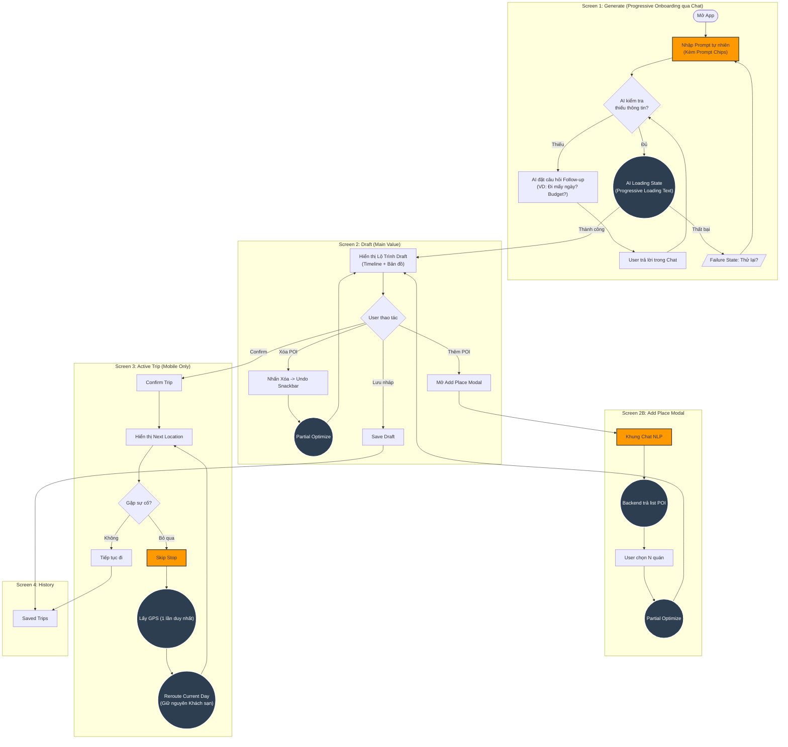

# Final MVP User Flow Diagram

Sơ đồ luồng hoàn chỉnh của AI Travel Optimizer, vào thẳng Conversation, tập trung sức mạnh vào Draft Edit Loop và xử lý Active Trip.

```mermaid
flowchart TD
    %% Màn hình 1: Generate & Progressive Onboarding
    subgraph M1 ["Screen 1: Generate (Progressive Onboarding qua Chat)"]
        Start(["Mở App"]) --> Nhập_NLP["Nhập Prompt tự nhiên\n(Kèm Prompt Chips)"]
        Nhập_NLP --> Backend_Check{"AI kiểm tra\nthiếu thông tin?"}
        Backend_Check -- "Thiếu" --> AI_Hỏi["AI đặt câu hỏi Follow-up\n(VD: Đi mấy ngày? Budget?)"]
        AI_Hỏi --> Trả_lời["User trả lời trong Chat"]
        Trả_lời --> Backend_Check
        Backend_Check -- "Đủ" --> AI_Thinking(("AI Loading State\n(Progressive Loading Text)"))
        AI_Thinking -- "Thất bại" --> F1[/"Failure State: Thử lại?"/]
        F1 --> Nhập_NLP
    end

    %% Màn hình 2: Draft
    subgraph M2 ["Screen 2: Draft (Main Value)"]
        AI_Thinking -- "Thành công" --> Lộ_trình["Hiển thị Lộ Trình Draft\n(Timeline + Bản đồ)"]
        
        Lộ_trình --> Thao_tác_Draft{"User thao tác"}
        
        Thao_tác_Draft -- "Xóa POI" --> Xóa_POI["Nhấn Xóa -> Undo Snackbar"]
        Xóa_POI --> Tối_ưu_lại_1(("Partial Optimize"))
        Tối_ưu_lại_1 --> Lộ_trình

        Thao_tác_Draft -- "Thêm POI" --> Mở_Modal["Mở Add Place Modal"]
        
        Thao_tác_Draft -- "Lưu nháp" --> Save_Draft["Save Draft"]
    end

    subgraph M2B ["Screen 2B: Add Place Modal"]
        Mở_Modal --> Chatbox["Khung Chat NLP"]
        Chatbox --> Gợi_ý_Quán(("Backend trả list POI"))
        Gợi_ý_Quán --> Chọn_Quán["User chọn N quán"]
        Chọn_Quán --> Tối_ưu_lại_2(("Partial Optimize"))
        Tối_ưu_lại_2 --> Lộ_trình
    end

    %% Màn hình 3: Active Trip
    subgraph M3 ["Screen 3: Active Trip (Mobile Only)"]
        Khóa["Confirm Trip"]
        Khóa --> Đi_chơi["Hiển thị Next Location"]
        Đi_chơi --> C2{"Gặp sự cố?"}
        C2 -- "Bỏ qua" --> Nhấn_Skip["Skip Stop"]
        Nhấn_Skip --> GPS(("Lấy GPS (1 lần duy nhất)"))
        GPS --> Tối_ưu_Reroute(("Reroute Current Day\n(Giữ nguyên Khách sạn)"))
        Tối_ưu_Reroute --> Đi_chơi
        C2 -- "Không" --> Hoàn_thành["Tiếp tục đi"]
    end

    Thao_tác_Draft -- "Confirm" --> Khóa

    %% Màn hình 4: History
    subgraph M4 ["Screen 4: History"]
        Save_Draft --> History["Saved Trips"]
        Hoàn_thành --> History
    end

    %% Định dạng CSS cho Sơ đồ
    classDef highlight fill:#ff9900,stroke:#333,stroke-width:2px;
    classDef backend fill:#2c3e50,stroke:#fff,stroke-width:2px,color:#fff;
    class Nhập_NLP,Chatbox,Nhấn_Skip highlight;
    class AI_Thinking,Tối_ưu_lại_1,Tối_ưu_lại_2,Gợi_ý_Quán,GPS,Tối_ưu_Reroute backend;
```
