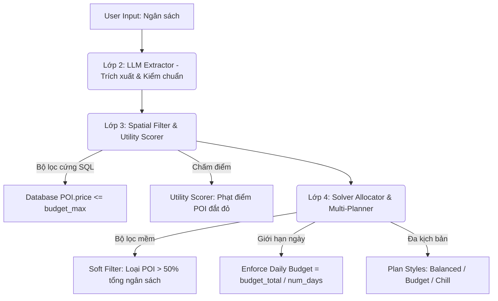

# Hướng Dẫn Vận Hành & Cơ Chế Tối Ưu Chi Phí Hệ Thống TripFlow AI

Tài liệu này tổng hợp chi tiết hai nội dung cốt lõi của hệ thống **TripFlow AI**:
1. Cơ chế tối ưu hóa chi phí (ngân sách) đa tầng.
2. Hướng dẫn vận hành dự án, cấu trúc dữ liệu và cách khởi chạy chuẩn xác.

---

## PHẦN 1: Cơ Chế Tối Ưu Hóa Chi Phí Đa Tầng (Budget Optimization)

Hệ thống tối ưu hóa chi phí được thiết kế theo một **quy trình đa tầng (multi-layer pipeline)** từ khâu xử lý ngôn ngữ tự nhiên, chọn lọc cơ sở dữ liệu đến thuật toán phân bổ và tối ưu hóa lộ trình.



### 1. Lớp 2: Trích xuất và Kiểm chuẩn (LLM Intent Extractor)
* **Trích xuất ý định:** LLM (DeepSeek) phân tích câu lệnh của người dùng để bóc tách thông tin ngân sách vào thuộc tính `budget_max` (VND) và phân loại cấp độ `budget_level` (low/medium/high/unlimited) trong hợp đồng dữ liệu (`LLMDataContract`).
* **Kiểm chuẩn (Validation):** Mức ngân sách tối thiểu được đặt là **50,000 VND**. Nếu thấp hơn, hệ thống sẽ báo lỗi `LLM_INVALID_BUDGET` để tránh lỗi logic. Nếu người dùng không nhập hoặc chọn "không giới hạn", cờ `budget_is_unlimited` được bật để bỏ qua toàn bộ bộ lọc chi phí.

### 2. Lớp 3: Lọc Dữ Liệu & Chấm Điểm Hữu Dụng (Spatial Filter & Utility Scorer)
* **Lọc cứng ở Cơ sở dữ liệu (PostGIS):**
  * Khi truy vấn danh sách POI tiềm năng từ PostGIS, hệ thống thực hiện theo các tầng dự phòng (**Fallback Tiers**). Ở Tầng 1 và 2 (bán kính gần), hệ thống áp dụng điều kiện cứng: `POI.price <= contract.budget_max` để loại ngay các điểm vượt ngân sách.
  * Chỉ khi không tìm thấy đủ số điểm tối thiểu (vét đáy), hệ thống mới bỏ bộ lọc cứng này ở Tầng 3 và 4 nhưng sẽ phạt nặng điểm số của chúng ở bước sau.
  * **Tối ưu chi phí lưu trú:** Nếu hệ thống tự động chọn khách sạn điểm xuất phát, nó áp dụng bộ lọc `POI.price <= budget_max * 0.3` để chi phí chỗ ở không chiếm quá 30% tổng quỹ tiền.
* **Chấm điểm hữu dụng theo ngân sách (Utility Scorer):**
  * Mỗi POI được tính một điểm ngân sách (`budget_score`), đóng góp **8%** vào tổng điểm hữu dụng của điểm đó.
  * Hàm tính điểm `_compute_budget_fit`:
    * Điểm đến miễn phí (`entrance_fee == 0`): Nhận điểm rất cao `0.7`.
    * Vé đơn lẻ chiếm trên 30% tổng ngân sách (`entrance_fee / budget_max > 0.3`): Phạt điểm thẳng tay xuống `0.2` (giảm mạnh tỷ lệ được chọn).
    * Ngược lại, điểm số tỷ lệ nghịch với giá vé: `1.0 - (entrance_fee / budget_max) * 3` (vé càng rẻ điểm càng cao).

### 3. Lớp 4: Phân Bổ Lộ Trình & Đa Kịch Bản (Solver & Multi-Planner)
* **Bộ lọc mềm (Soft Budget Filter):**
  * Trước khi phân bổ, thuật toán chạy bộ lọc `_soft_budget_filter`: tự động loại bỏ các điểm đơn lẻ có giá vé chiếm hơn 50% tổng ngân sách, trừ khi điểm đó có độ ưu tiên cực cao (`priority_score >= 0.3`).
* **Phân bổ ngân sách theo ngày (Enforcing Daily Budget):**
  * Hệ thống chia đều quỹ tiền theo số ngày: `budget_per_day = budget_total / num_days`.
  * Trong quá trình xếp điểm vào từng ngày, thuật toán kiểm tra nghiêm ngặt: `used_budget + poi.entrance_fee <= budget_per_day`. Nếu vượt quá giới hạn ngày, điểm đó sẽ bị bỏ qua hoặc chuyển sang ngày khác để đảm bảo chi tiêu cân bằng xuyên suốt chuyến đi.
* **Đa kịch bản (Multi-Planner):**
  * Hệ thống luôn tính toán song song 3 phương án:
    1. **Cân bằng (Balanced):** Sử dụng 100% định mức ngân sách (`budget_factor = 1.0`).
    2. **Tiết kiệm (Budget):** Ép chặt chi tiêu hơn bằng cách nhân thêm hệ số **0.7** (`budget_factor = 0.7`), ưu tiên các điểm miễn phí/rất rẻ.
    3. **Thoải mái (Chill):** Giảm mật độ điểm đi, tập trung nghỉ ngơi.
* **Cảnh báo chỉ số (Plan Metrics):**
  * Sau khi tối ưu hóa đường đi bằng OR-Tools, nếu tổng chi phí vé thực tế vượt quá ngân sách đề ra, hệ thống sẽ bật cảnh báo `"budget": true` hiển thị trực tiếp lên giao diện để người dùng cân nhắc.

---

## PHẦN 2: Dữ Liệu Thực Tế & Hướng Dẫn Vận Hành Hệ Thống

### 1. Phân Tích Dữ Liệu POIs Hiện Tại
Trái ngược với thông tin "chỉ có 61 POIs" ở các phiên bản thử nghiệm cũ, cơ sở dữ liệu hiện tại trong volume sản xuất chứa **774 POIs** được phân bổ chuẩn xác như sau:

| Nhóm danh mục (Category Group) | Số lượng POIs | Ghi chú |
| :--- | :---: | :--- |
| **Cà phê (`cafe`)** | 261 | Các quán cà phê đặc sản, cafe muối, trà quán |
| **Ăn uống (`food`)** | 181 | Quán ăn địa phương, nhà hàng, quán vỉa hè |
| **Lưu trú (`hotel`)** | 155 | Khách sạn, homestay (được lọc riêng, không xếp vào điểm tham quan) |
| **Văn hóa (`culture`)** | 136 | Di tích lịch sử, chùa chiền, lăng tẩm Cố đô |
| **Thiên nhiên (`nature`)** | 17 | Công viên, sông ngòi, đồi núi cảnh quan |
| **Mua sắm (`shopping`)** | 8 | Các chợ truyền thống (Đông Ba, An Cựu), cửa hàng đặc sản |
| **Khám phá (`adventure`)** | 7 | Điểm trekking, dã ngoại ngoài trời |
| **Giải trí về đêm (`nightlife`)** | 6 | Bar, pub, chợ đêm |
| **Sức khỏe (`wellness`)** | 3 | Spa, massage trị liệu |
| **TỔNG CỘNG** | **774** | **Đầy đủ dữ liệu không gian (PostGIS) & Vector Embeddings** |

---

### 2. Quy Trình Khởi Chạy Chuẩn Xác

Để khởi chạy toàn bộ hệ thống (bao gồm Database, OSRM Routing Engine, OR-Tools Solver, FastAPI Gateway và React/Next.js Web UI), vui lòng thực hiện đúng theo các chỉ dẫn sau:

#### Bước 1: Khởi động Docker Containers (Backend Services)
Mở terminal tại thư mục gốc của dự án (`d:\Workspaces\AI travel optimizer\Routing Engine`) và chạy lệnh:

```bash
docker compose up -d
```

> [!IMPORTANT]
> **Lưu ý về Volume:** Bạn phải chạy lệnh trên ở thư mục gốc của dự án. File `docker-compose.yml` ở đây được cấu hình dùng chung Volume tên là `layer2_3_gateway_travel_data`. Việc chạy lệnh ở thư mục gốc giúp liên kết đúng cơ sở dữ liệu chứa đầy đủ **774 POIs** thay vì tạo ra một volume trống mới.

Lệnh này sẽ kích hoạt và duy trì 4 dịch vụ cốt lõi:
* `travel-db` (Port `5432`): Database chứa 774 POIs và các bảng địa lý.
* `routing-osrm-hue` (Port `5001`): Routing engine phục vụ tính toán khoảng cách giao thông tại Huế.
* `cvrptw-solver` (Port `8000`): Engine tối ưu hóa hành trình OR-Tools.
* `travel-gateway` (Port `8001`): Gateway chính điều phối luồng dữ liệu API.

#### Bước 2: Khởi động Giao diện Người dùng (Frontend Next.js)
Mở một terminal mới, chuyển hướng vào thư mục webui và chạy server phát triển:

```bash
cd fleet-route-optimizer-cvrptw/webui
npm run dev
```

Server frontend sẽ được khởi chạy tại địa chỉ: **`http://localhost:3000`**

---

### 3. Các Câu Lệnh Chẩn Đoán và Kiểm Tra Dữ Liệu nhanh

Dưới đây là một số câu lệnh hữu ích giúp bạn kiểm tra trạng thái hoạt động của hệ thống:

* **Kiểm tra trạng thái các container:**
  ```bash
  docker ps
  ```
  *(Đảm bảo cả 4 container đều ở trạng thái `Up` và `cvrptw-solver` cũng như `travel-db` báo trạng thái `healthy`)*

* **Xác minh số lượng POIs trực tiếp trong DB đang chạy:**
  ```bash
  docker exec travel-db psql -U travel -d travel -c "SELECT count(*) FROM travel.poi;"
  ```

* **Kiểm tra phân bổ danh mục POIs trong DB:**
  ```bash
  docker exec travel-db psql -U travel -d travel -c "SELECT category_group, count(*) FROM travel.poi GROUP BY category_group ORDER BY count(*) DESC;"
  ```

* **Xem logs trực tiếp của API Gateway để debug luồng LLM:**
  ```bash
  docker logs -f travel-gateway
  ```
